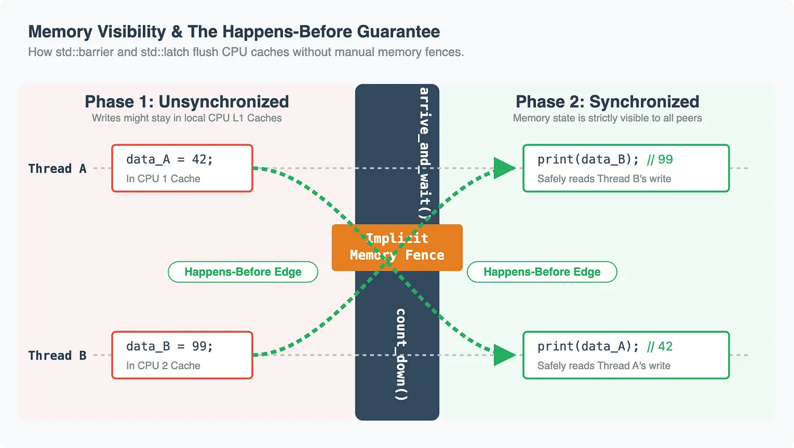
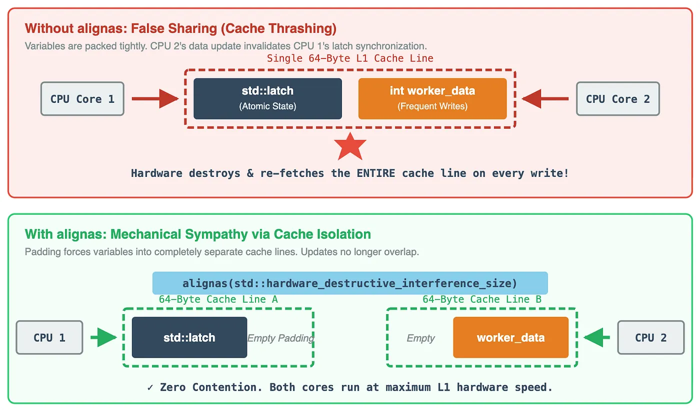

### std::latch / std::barrier (Memory Ordering):

Beyond control flow, both std::latch and std::barrier establish critical synchronization points within the C++ memory model.

When thread A performs computations, those memory writes are not automatically visible to thread 
B due to CPU caching and compiler reordering. 

However, writes performed before a call to `count_down()` or `arrive_and_wait()` are strictly guaranteed to happen-before the unblocking of threads exiting the synchronization phase. 

No need explicit `std::atomic_thread_fence` calls; the primitives guarantee your memory state is visible across all peers before the next phase begins

### std::latch / std::barrier (False Sharing):

These primitives contain highly contended atomic variables. 
If you place a `std::latch` in a struct right next to frequently updated worker data, you will induce false sharing.
    
The hardware prefetcher will pull the latch and the worker data into the same L1 cache line (64 bytes on most x86/ARM architectures). 
    
Every time a thread updates its local data, it will accidentally invalidate the cache line containing the latch for all other threads, destroying the performance of the synchronization point.
